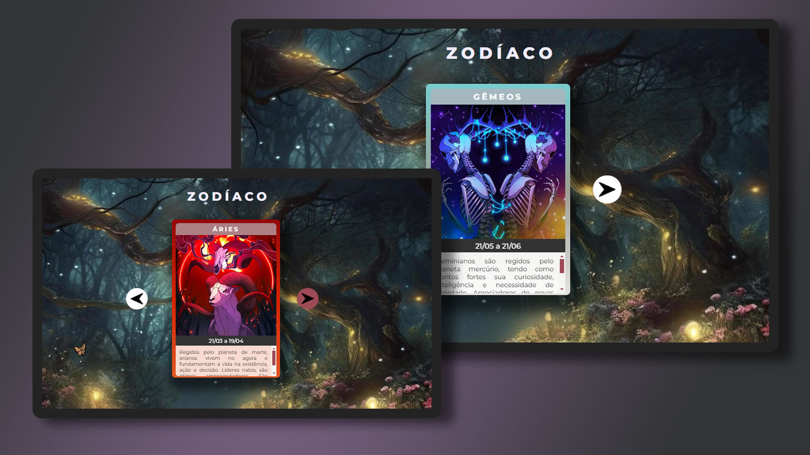

# zodiac-cards

<h1 align="center"> Zodiac Cards </h1>

Cartas do zodíaco com especificações e informações dos doze signos.

 

  

## 🚀 Tecnologias

Esse projeto foi desenvolvido com as seguintes tecnologias:

- HTML e CSS
- JavaScript
- Git e Github
- Photoshop

## 💻 Projeto e Desenvolvimento
Página criada com base no projeto do DevEmDobro, desenvolvendo cards informativos acerca dos signos do zodíaco.
Para fins de estudo, o site é responsivo e utiliza o sistema de arrays na passada de cards, seja para avançar ou voltar.

Design autoral e original.
Imagens retiradas do site https://shop.dionneong.com/.